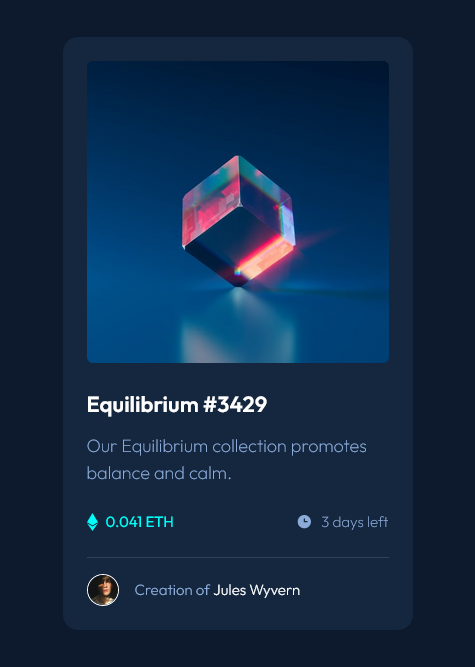
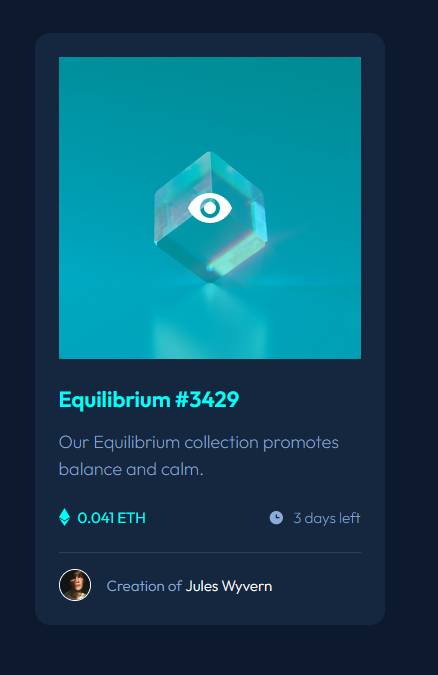
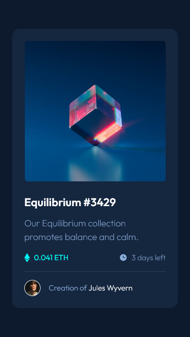

# Mobile First Responsive Product preview card component

## Table of contents

-   [Overview](#overview)
    -   [The challenge](#the-challenge)
    -   [Screenshots](#screenshots)
    -   [Links](#links)
-   [My process](#my-process)
    -   [Built with](#built-with)
    -   [What I learned](#what-i-learned)
    -   [Continued development](#continued-development)
    -   [Useful resources](#useful-resources)
-   [Author](#author)
-   [Acknowledgments](#acknowledgments)

## Overview

### The challenge

This was my first attempt at using only HTML and Tailwind CSS to design this NFT component. It was definitely challenging to use Tailwind until I started to pick up on the syntax. I can see why Tailwind can be so powerful and save you a lot of time.

Users should be able to:

-   View the optimal layout depending on their device's screen size
-   See hover and focus states for interactive elements

### Screenshots

Dekstop View



Desktop Hover States



Mobile View



### Links

-   Solution URL: [Github](https://github.com/NicholasAnich/NFT-Card-Component)
-   Live Site URL: [Netlify Page](https://tranquil-conkies-de56ab.netlify.app/)

## My process

### Built with

-   Semantic HTML5 markup
-   CSS custom properties
-   Tailwind
-   Flexbox
-   Mobile-first workflow

### What I learned

This was a very good learning experience using Tailwind. It was awesome and also frustrating trying to style everything right from the element itself. I kept wanting to revert back to scss or css but glad I pushed through.

⚠️ [ NOTE ] ⚠️ Make sure to run `npm init` in your terminal for Tailwind to work.❗

Here is my tailwind.config file. It was nice to make custom variables that I was able to use for specific needs like colors or screens (breakpoints).

```js
/** @type {import('tailwindcss').Config} */
module.exports = {
    plugins: [require("prettier-plugin-tailwindcss")],
    content: ["./index.html"],
    theme: {
        fontFamily: {
            sans: ["Outfit", "sans-serif"],
        },
        extend: {
            width: {
                278: "17.375rem",
            },
            backgroundImage: {
                eyeOverlay: "url('/images/icon-view.svg')",
            },
        },
        colors: {
            softBlue: "#8BACD9",
            white: "#FFFFFF",
            cyan: "#00FFF8",
            mainBg: "#0D192C",
            cardBg: "#15263F",
            blueLine: "#2E405A",
        },
        fontSize: {
            para: "1.125rem",
            title: "1.375rem",
            pricing: "0.9375rem",
        },
        maxWidth: {
            containerMobile: "20.4375rem",
        },
        screens: {
            desktop: "23.75em",
        },
    },
    plugins: [],
};
```

### Continued development

Clean up and refactor any uneeded HTML or CSS.

### Useful resources

-   [Tailwind Installation](https://tailwindcss.com/docs/installation) - I mainly Read the Documentation to get Tailwind setup and running.

-   [Tailwind Responsive Design](https://tailwindcss.com/docs/responsive-design) - This allowed me to reference properties and methods of flexbox.

-   [Netflify Page Deployment](https://www.netlify.com/) - I use Netlify for deploment because I found github pages can sometimes be buggy.

## Author

-   Frontend Mentor - [@NicholasAnich](https://www.frontendmentor.io/profile/yourusername)
-   GitHub - [@NicholasAnich](https://github.com/NicholasAnich)

## Acknowledgments

This is a solution to the [NFT preview card component](https://www.frontendmentor.io/challenges/nft-preview-card-component-SbdUL_w0U). Frontend Mentor challenges help you improve your coding skills by building realistic projects.
